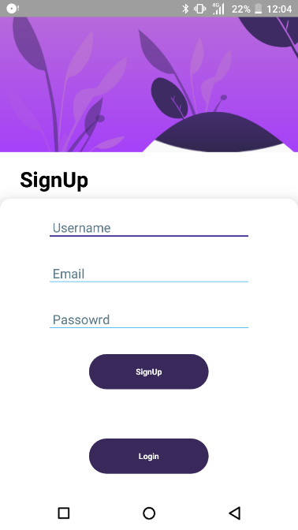
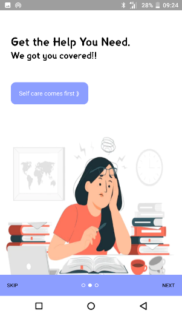
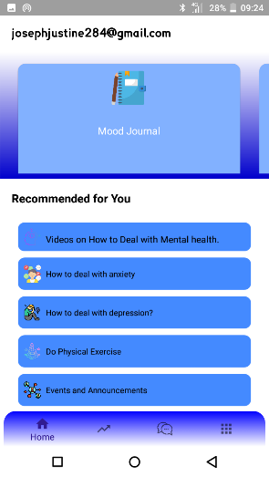
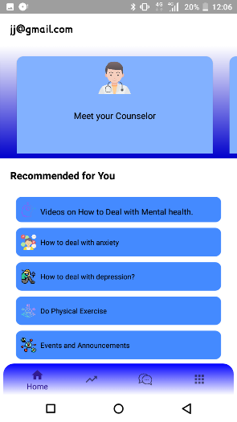
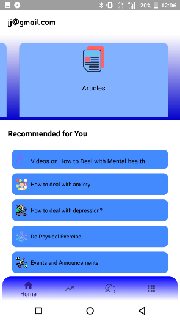
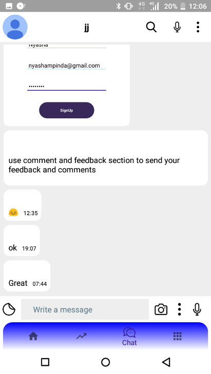
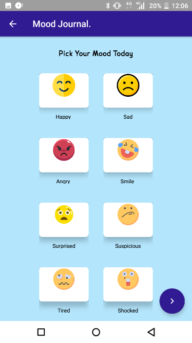
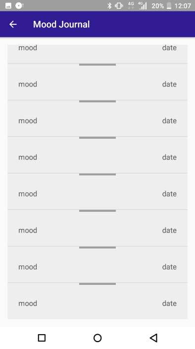

# MY-Brain-mental-health-awareness-Android Application
"My-Brain" is a mental health awareness app designed to support MUBAS students in managing their mental well-being. This app offers a range of features and resources to promote mental health awareness and self-care. Users can track their mood, emotions, and daily experiences to gain insights into their mental health patterns. It also provides educational content on mental health topics, including articles, videos, and self-help guides.

"My-Brain" offers a community aspect, allowing users to connect with others who may be facing similar challenges. It provides a safe space for sharing experiences and seeking support. The app include tools for setting and tracking mental health goals, meditation and relaxation exercises, offline voice based chat bot, and even crisis intervention features for immediate help in times of distress.

Ultimately, "My-Brain" is a comprehensive app that encourages mental health awareness, self-reflection, and connection with others in an effort to promote overall well-being and reduce the stigma surrounding mental health.

<h2 align="center" class="section-heading">🌐 My Brain</h2>

 Below is a lost of screen shots of the app, showing some of the key festures 

    
  
  
  
    
  
  

 

 
 
 
 

